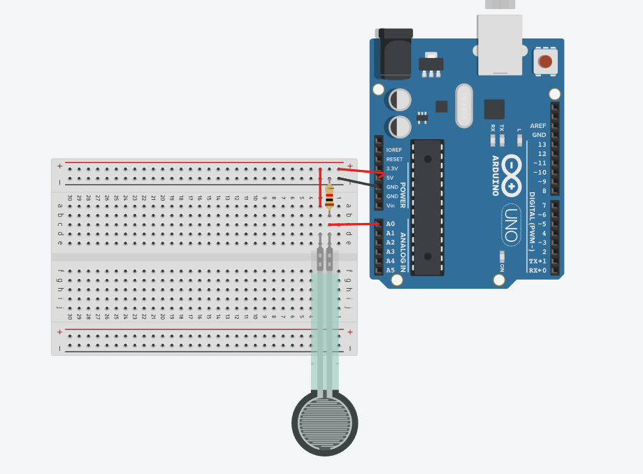

#  Arduino Uno with FSR sensors for Simulated Keyboard Input

The Arduino Uno is not natively a USB HID device that can send real keyboard/joystick events. Instead, you might use the sensor states to trigger actions in your sketch or send messages over Serial to a host program `py_serial.py`. (Other boards like the Leonardo have native USB HID support.) 


## Table of Contents

- [Overview](#overview)
- [Setup](#setup)
  - [Arduino Code](#arduino-code)
  - [Python Serial Interpreter](#python-serial-interpreter)
- [Circuit](#circuit)

## Overview

This code is one way to “simulate” a button press from each FSR. In this example each FSR is connected to one of the analog pins (A0–A4) on the Uno. (Even though the Uno has A0–A5, we’ll use 5 sensors.) We read the analog value from each sensor every loop and compare it to a chosen threshold. When the reading goes above the threshold (meaning there’s enough force on the sensor) we “register” a press (for example by printing a message to the Serial Monitor), and when the reading falls below the value we “release” it.


## Setup 

### Arduino code

1. Install Arduino IDE (if you don't have it already)
1. Load fsr_arduino.ino in Arduino IDE
1. Adjust the threshold in the code depending on your needs
1. Push the code to the board

### Python serial interpreter

1. To make this work, you will need to install the pyinput package.

```
pip install pyinput
```

1. Make sure you have permissions for the board

* Single use time:

```
sudo chmod a+rw /dev/ttyACM0
```

* Make the settings permanent

You can create a udev rule:

1. **Identify Device Information**: Use the `lsusb` command to find the `idVendor` and `idProduct` of your device. Run `lsusb` twice, once with the device connected and once without, to identify the new line that appears.

    *. To get the `idVendor` and `idProduct` from the lsusb output, you can look at the ID field in the output line. For example, the output is:

    Bus 002 Device 012: ID 2451:0047 Arduino SA Uno R3 (CDC ACM)

    idVendor: This is the first part of the ID, which is 2451 in this case
    idProduct: This is the second part of the ID, which is 0047 in this case.

2. **Create Udev Rule**: Create a new file in the `/etc/udev/rules.d/` directory, for example, `50-myusb.rules`:

   ```bash
   sudo nano /etc/udev/rules.d/50-myusb.rules
   ```

3. **Add Rule Content**: Add the following content to the file, replacing `ffff` and `0005` with your device's `idVendor` and `idProduct`:

   ```bash
   ACTION=="add", KERNEL=="ttyACM[0-9]*", ATTRS{idVendor}=="ffff", ATTRS{idProduct}=="0005", MODE="0666"
   ```


4. **Reload Udev Rules**: After saving the file, reload the udev rules with:

   ```bash
   sudo udevadm control --reload-rules
   sudo udevadm trigger
   ```

5. You may need to disconnect and reconnect the Arduino for the changes to take effect

## Circuit

1. **Understanding the FSR**: 
   - An FSR is a variable resistor that changes its resistance based on the pressure applied to it. The more pressure applied, the lower the resistance.
   - FSRs are not highly accurate for measuring exact weights but are excellent for detecting pressure changes.

2. **Circuit Design**:
   - The FSR is connected in series with a fixed resistor (commonly 10kΩ) to form a voltage divider circuit.
   - The voltage across the fixed resistor changes with the pressure applied to the FSR, which can be read by the Arduino's analog input.

3. **Wiring the Circuit**:
   - Connect one terminal of the FSR to the 5V pin on the Arduino.
   - Connect the other terminal of the FSR to one terminal resistor (in my case i am using a 220Ω resistor).
   - Connect the other terminal of the resistor to the GND pin on the Arduino.
   - Connect the junction of the FSR and the resistor to the A0 analog input pin on the Arduino.
   - Repeat the same process for the other sensors, connecting them to their respective analog input pins on the Arduino.


